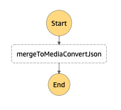
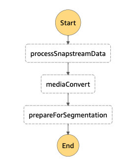
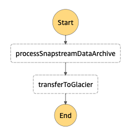
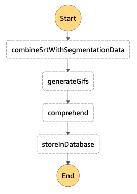
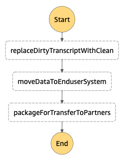

# State Machines

Code for state machines written in Amazon State Language (ASL)

## Edit MediaConvert settings

The execution of this machine is unrelated to any other part of the workflow and is initiated any time the MediaConvert settings need to be changed due to a change in the way the system is operating.

## System 1

This machine is triggered by a CloudWatch event generated by files from Snapstream dropping into one of the network output S3 buckets.

The structure came from [this diagram](https://github.com/HeardLibrary/cloud-tvnews/pull/11#issuecomment-484580646) with additional notes [here](https://github.com/HeardLibrary/cloud-tvnews/pull/11#issuecomment-484597103).  The state machine in its current form only creates the structure -- it does not actually pass variables that would control the flow.

## Move high-res to long-term storage

This machine is triggered by the same CloudWatch event as the System 1 machine, but operates independently.

The machine ends with waiting for human (or other agent) action on segmentation.

## System 2

The system 2 machine is triggered by the completion of segmentation process.  The segmentation times are combined with SRT data.

The machine ends with the segment data, generated GIFs, and tags from Comprehend being stored in the database. (If there's a time lag from Yewno processing, then the storage step won't depend on the output from the Comprehend step.)

## System 3

This machine is triggered when the human-mediated transcript cleanup process is finished.

At the end, the cleaned up data in the database get moved into the production system that the end-user interacts with.  Not sure how the packaged data would go out to the partner institutions.

# Notes

## CloudTrail for S3 bucket drops

See <https://docs.aws.amazon.com/step-functions/latest/dg/tutorial-cloudwatch-events-s3.html> for info on creating a trail and CloudWatch event rule for S3 bucket drops.

Created trail named `vu-tvnews-bucket-drops`.  Triggers on read/write for all of the `vu-tvnews-nnn` network buckets.  Output goes to `vu-tvnews-bucket-drops-cloudtrail`.

It's not clear to me how the CloudTrail interacts with this CloudWatch rule.

The CloudWatch rule created a new role for the `system1processing` state machine: `AWS_Events_Invoke_Step_Functions_1247018973`.  Saved the event pattern as `cloudwatchEventPattern_system1processing.json`.

The rule can have multiple targets (trigger multiple state machines).  This rule currently triggers both the `system1processing` and `highresStorage` state machines.

----
Revised 2019-04-17
