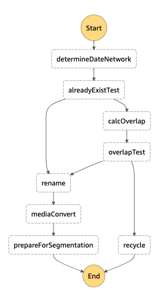

# State Machines

Code for state machines written in Amazon State Language (ASL)

## Edit MediaConvert settings

## System 1

## Move high-res to long-term storage

## System 2

# Notes

## CloudTrail for S3 bucket drops

See <https://docs.aws.amazon.com/step-functions/latest/dg/tutorial-cloudwatch-events-s3.html> for info on creating a trail and CloudWatch event rule for S3 bucket drops.

Created trail named `vu-tvnews-bucket-drops`.  Triggers on read/write for all of the `vu-tvnews-nnn` network buckets.  Output goes to `vu-tvnews-bucket-drops-cloudtrail`.

It's not clear to me how the CloudTrail interacts with this CloudWatch rule.

The CloudWatch rule created a new role for the `system1processing` state machine: `AWS_Events_Invoke_Step_Functions_1247018973`.  Saved the event pattern as `cloudwatchEventPattern_system1processing.json`.

The rule can have multiple targets (trigger multiple state machines).  This rule currently triggers both the `system1processing` and `highresStorage` state machines.

----
Revised 2019-04-10
